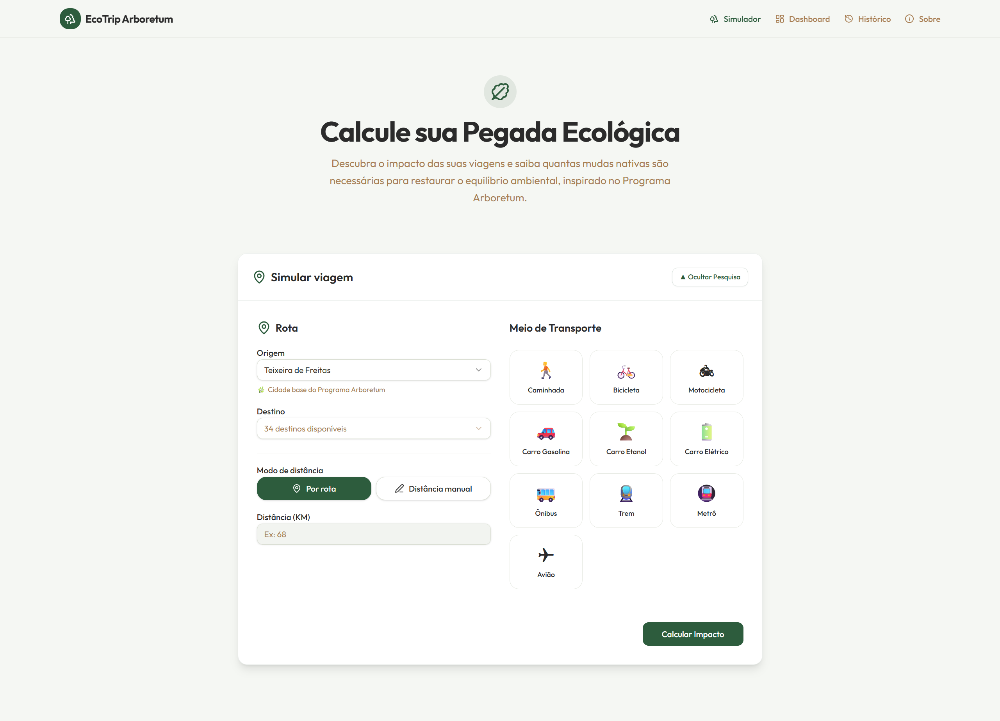

# 🌿 EcoTrip Arboretum

Simulador educacional de impacto ambiental para viagens, desenvolvido durante o bootcamp da DIO **CI&T - Do Prompt ao Agente**.

O EcoTrip Arboretum estima emissões de CO₂, calcula um **EcoScore Ambiental** e apresenta uma estimativa de compensação florestal por meio do plantio de mudas nativas da Mata Atlântica.

Inspirado pelo **Programa Arboretum**, o projeto busca unir tecnologia, educação ambiental e conscientização climática, incentivando escolhas mais sustentáveis nos deslocamentos do dia a dia.

---

## 🚀 Demonstração

🔗 **Repositório:** https://github.com/MariliaVitorio/desafio-dio-calculadora-ecotrip

🔗 **Aplicação:** Em breve (GitHub Pages)

---


---

## 📸 Telas do Projeto

### Simulador



### Dashboard


### Página Sobre


---

## 🎯 Objetivo

O EcoTrip Arboretum foi criado para demonstrar como ferramentas digitais podem contribuir para a conscientização ambiental.

Por meio da comparação entre diferentes meios de transporte, o usuário consegue visualizar o impacto ambiental de seus deslocamentos, compreender conceitos relacionados à pegada de carbono e conhecer alternativas para reduzir ou compensar emissões.

O projeto também busca aproximar tecnologia e sustentabilidade, promovendo educação ambiental de forma acessível e interativa.

---

## 🌟 Diferenciais do Projeto

Diferente da proposta original apresentada durante o bootcamp, o EcoTrip Arboretum foi regionalizado para a área de atuação do Programa Arboretum, abrangendo municípios do:

* Extremo Sul da Bahia;
* Norte do Espírito Santo;
* Vale do Mucuri (Minas Gerais).

O projeto também incorpora conceitos de:

* Educação ambiental;
* Pegada de carbono;
* EcoScore ambiental;
* Compensação florestal;
* Conservação da Mata Atlântica;
* Sustentabilidade aplicada à tecnologia.

Essa adaptação aproxima o simulador da realidade socioambiental da região da Hileia Baiana, tornando a experiência mais significativa para usuários locais.

---

## 🌱 Inspiração

O projeto foi inspirado pelo Programa Arboretum, uma iniciativa de referência nacional na restauração da Mata Atlântica e conservação da biodiversidade.

O programa atua em diversas frentes, incluindo:

* Produção de mudas nativas;
* Coleta e beneficiamento de sementes;
* Pesquisa científica;
* Capacitação de comunidades locais;
* Recuperação de áreas degradadas;
* Conservação da biodiversidade da Mata Atlântica.

Saiba mais: https://www.programaarboretum.eco.br/

---

## 🎓 Bootcamp CI&T - Do Prompt ao Agente

Este projeto foi desenvolvido como desafio prático do módulo "Desafio Projeto Final - Desenvolvendo uma Solução com Copiloto de IA" do Bootcamp "CI&T - Do Prompt ao Agente" promovido pela DIO.

Durante o desenvolvimento foram aplicados conceitos de:

* Engenharia de Prompt;
* Desenvolvimento assistido por Inteligência Artificial;
* GitHub Copilot;
* React;
* TypeScript;
* Vite;
* Componentização;
* Boas práticas de desenvolvimento;
* Documentação técnica.

---

## 📊 Cobertura do Simulador

| Indicador            | Valor |
| -------------------- | ----: |
| Municípios           |    37 |
| Rotas cadastradas    |   101 |
| Modais de transporte |    10 |
| Regiões atendidas    |     3 |

### Regiões contempladas

* Extremo Sul da Bahia
* Norte do Espírito Santo
* Vale do Mucuri (Minas Gerais)

O conjunto de rotas foi construído com foco na região da **Hileia Baiana**, território de atuação do Programa Arboretum.

**Origem padrão:** Teixeira de Freitas (BA)

> As distâncias utilizadas são aproximadas e os resultados possuem caráter educacional.

---

## ✨ Funcionalidades

* Cálculo de emissões de CO₂ por viagem;
* Comparação entre 10 modais de transporte;
* Cálculo de EcoScore Ambiental;
* Estimativa de compensação por mudas nativas;
* Simulação por rota cadastrada;
* Simulação por distância manual;
* Dashboard com indicadores ambientais;
* Curiosidades e dicas de sustentabilidade;
* Cobertura regional do Extremo Sul da Bahia, Norte do Espírito Santo e Vale do Mucuri (MG);
* Interface responsiva para desktop e dispositivos móveis.

---

## 🚗 Modais Disponíveis

* Caminhada
* Bicicleta
* Motocicleta
* Carro Flex
* Carro Gasolina
* Carro Diesel
* Ônibus Urbano
* Ônibus Rodoviário
* Trem
* Avião

---

## 📊 Metodologia

Os cálculos utilizam fatores médios de emissão de carbono para diferentes modais de transporte.

O EcoScore é calculado com base na eficiência ambiental do modal escolhido em relação à distância percorrida.

A compensação ambiental é estimada considerando que uma muda nativa da Mata Atlântica pode compensar aproximadamente **15 kg de CO₂** durante seu desenvolvimento inicial.

Os resultados apresentados possuem caráter educacional e não substituem inventários oficiais de emissões de Gases de Efeito Estufa (GEE).

---

## 🗂️ Páginas

| Página       | Descrição                                                                  |
| ------------ | -------------------------------------------------------------------------- |
| `/`          | Simulador de impacto ambiental                                             |
| `/dashboard` | Indicadores ambientais, curiosidades e dicas sustentáveis                  |
| `/about`     | Informações institucionais, metodologia e inspiração no Programa Arboretum |

---

## 🛠️ Tecnologias Utilizadas

### Frontend

* React 19
* TypeScript
* Vite 7
* Tailwind CSS 4

### Interface

* Radix UI
* Framer Motion
* Wouter

### Gerenciamento

* pnpm Workspaces

### Dados Locais

* Rotas e municípios armazenados localmente
* Sem banco de dados
* Sem API externa

---

## 📁 Estrutura do Projeto

```text
docs/
  images/
    simulator/
    dashboard/
    about/
    logo/

artifacts/
  ecotrip/
    src/
      pages/
        Home.tsx
        Dashboard.tsx
        About.tsx

      lib/
        routes-db.ts
        constants.ts
        dashboard-content.ts

scripts/
```

---

## ⚙️ Pré-requisitos

* Node.js 20+
* pnpm 10+

---

## 🚀 Instalação

### Instalação rápida

```bash
pnpm install
pnpm bootstrap
pnpm dev:web
```

Acesse:

```text
http://localhost:5173
```

### Instalação manual

Linux / macOS:

```bash
cp .env.example .env
pnpm install
pnpm dev:web
```

Windows (PowerShell):

```powershell
Copy-Item .env.example .env
pnpm install
pnpm dev:web
```

---

## 📜 Scripts

| Comando            | Descrição                     |
| ------------------ | ----------------------------- |
| pnpm bootstrap     | Cria o arquivo .env           |
| pnpm dev:web       | Executa o frontend localmente |
| pnpm run typecheck | Executa validação TypeScript  |
| pnpm run build     | Gera build de produção        |

---

## 🌍 Deploy

A publicação do projeto é realizada por meio do GitHub Pages com automação via GitHub Actions.

Após cada atualização enviada para a branch principal, uma nova versão do site é publicada automaticamente.

Plataformas compatíveis:

* GitHub Pages (utilizada neste projeto)
* Vercel
* Netlify

---

## 🛣️ Roadmap

### Concluído

* [x] Simulador de emissões
* [x] EcoScore Ambiental
* [x] Compensação florestal
* [x] Dashboard educativo
* [x] Página Sobre
* [x] Regionalização para Hileia Baiana
* [x] Integração conceitual com o Programa Arboretum

### Futuras Melhorias

* [ ] Exportação de relatórios
* [ ] Integração com APIs de rotas
* [ ] Mapa interativo
* [ ] Estatísticas avançadas
* [ ] Comparação de viagens
* [ ] Integração com projetos de restauração ambiental

---

## 🤝 Créditos

Este projeto foi desenvolvido para fins educacionais durante o Bootcamp GitHub Copilot da DIO.

A inspiração temática e ambiental foi baseada nas ações do Programa Arboretum, importante iniciativa brasileira voltada à restauração florestal e conservação da biodiversidade.

O EcoTrip Arboretum não possui vínculo institucional, comercial ou operacional com o Programa Arboretum.

---

## ⚠️ Aviso

Este projeto possui finalidade educacional e de conscientização ambiental.

Os resultados apresentados são estimativas simplificadas e não devem ser utilizados como inventários oficiais de emissões ou para fins regulatórios.

---

## 📄 Licença

Este projeto está licenciado sob a Licença MIT.

Consulte o arquivo LICENSE para mais informações.
